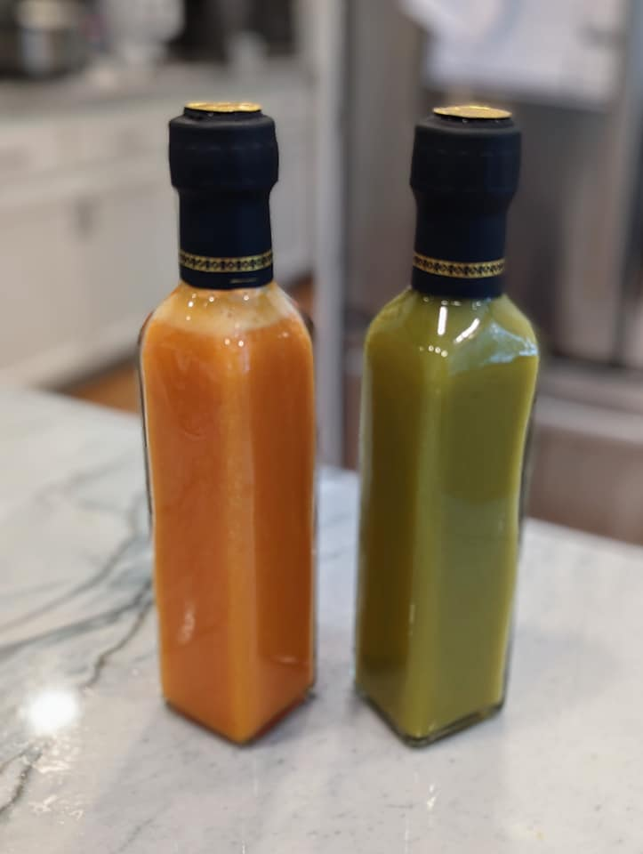

Pineapple Hot Sauce
===================

*The orange one on the left.*

Ingredients
-----------
- 200g pineapple
- 50g bird's eye peppers (fermented)
- 10g ginger
- juice of one lime
- 2/3c water
- 1/3c vinegar 
- 1/4 tsp xanthan gum
- 1/8 tsp cumin
- 1/4 tsp salt

Instructions
------------

1. Blend all ingredients.
2. Optional: Filter through fine mesh to create a more sauce-like result.  (Or leave slightly chunky.)

Made about 15oz.

Notes
-----
- Could go less on the peppers next time.  (Maybe 1/2?)
- Does the cumin make a difference?
- Some similar recipes have onion as well.
